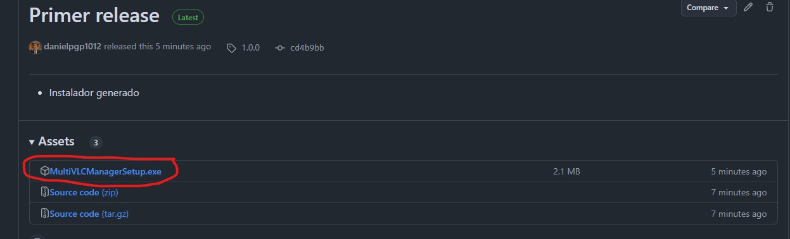
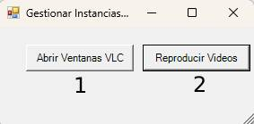

# Multi VLC Manager
(Esta documentación fue generada con modelos de Lenguaje)

**Multi VLC Manager** es una aplicación para Windows que permite abrir múltiples instancias de **VLC Media Player** y reproducir varios archivos de video simultáneamente. Cada ventana puede reproducir un archivo con audio en distintos idiomas, como español, francés e inglés, de forma simultánea.
---

## 📋 **Características**
- Abre **tres instancias de VLC Media Player** al mismo tiempo.
- Permite reproducir **videos con diferentes audios** simultáneamente.
- Interfaz amigable con opciones para abrir y reproducir videos fácilmente.
- Incluye un instalador para una instalación rápida y sencilla.
- Verifica automáticamente si **VLC está instalado** y guía al usuario para descargarlo si no lo está.

---

## 💻 **Requisitos del Sistema**
1. **Sistema Operativo**: Windows 10 o superior.
2. **Software Requerido**:
   - [VLC Media Player](https://www.videolan.org/vlc/index.html) (versión 3.0 o superior).
3. **Espacio en Disco**: Al menos 20 MB.

---

## 🚀 **Instalación**
1. **Descarga el instalador**:
   - Descarga el archivo `MultiVLCManagerSetup.exe` desde la [página de releases](https://github.com/danielpgp1012/MULTI_VLC/releases).
  

1. **Ejecuta el instalador**:
   - Sigue las instrucciones del asistente de instalación.
2. **Verificación de VLC**:
   - Si VLC no está instalado, el instalador te redirigirá a la página oficial de descarga.

---

## 🛠️ **Uso**
1. Abre **Multi VLC Manager** desde el acceso directo en el escritorio o el menú Inicio.
   <br>
   

2. Haz clic en **"Abrir Ventanas VLC"** para seleccionar un archivo de video.
   <br>
   

3. La aplicación abrirá tres instancias de VLC.
4. Selecciona los idiomas y canales correctos en cada ventana.
5. Haz clic en **"Reproducir Videos"** para iniciar la reproducción simultánea en las tres ventanas.

---

### **🛠️ Generar nuevo instalador**

1. **Convertir el script PowerShell a ejecutable**:  
   Usa **PS2EXE** para generar `Multi_vlc.exe`:
   ```powershell
   Install-Module -Name ps2exe -Scope CurrentUser
   Invoke-ps2exe .\MultiVLCManager.ps1 .\Multi_vlc.exe
   ```

2. **Compilar el instalador**:  
   - Abre `multi_vlc_installer.iss` en **Inno Setup**.  
   - Compila presionando `F9`.  

3. **Resultado**:  
   Se generará el instalador **`MultiVLCManagerSetup.exe`** listo para distribuir.  

---

## 📦 **Estructura del Proyecto**
```plaintext
Multi VLC Manager/
├── Multi_vlc.exe                # Ejecutable principal
├── multi_vlc_icon.ico           # Icono personalizado para la aplicación
├── multi_vlc_installer.iss             # Script de Inno Setup
├── README.md                    # Este archivo
```

---

## 🧩 **Desinstalación**
- Para desinstalar la aplicación, usa:
   - **"Desinstalar Multi VLC Manager"** en el menú Inicio.
   - O desde **Panel de Control > Programas y características**.

---

## 📄 **Licencia**
Este proyecto está bajo la licencia **MIT**. Consulta el archivo [LICENSE](https://github.com/danielpgp1012/MULTI-VLC/blob/main/LICENSE) para más detalles.

---

## 🤝 **Contribuciones**
¡Las contribuciones son bienvenidas!